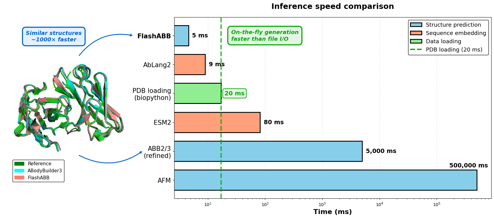

# FlashABB: modelling antibody structures at the speed of language



Installation:

```bash
pip install flash-abb
```

Or from source:

```bash
git clone git@github.com:oxpig/FlashABB.git
cd FlashABB
pip install .
```

## Structure prediction

The following is also in `example.py` and can be used to create the structures in `sample_preds`.

```python
from flash_abb import pretrained
import torch

flabb = pretrained(device='cuda')

# Sequences in heavy|light format
seqs = [
    'EVQLLESGGEVKKPGASVKVSCRASGYTFRNYGLTWVRQAPGQGLEWMGWISAYNGNTNYAQKFQGRVTLTTDTSTSTAYMELRSLRSDDTAVYFCARDVPGHGAAFMDVWGTGTTVTVSS|DIQLTQSPLSLPVTLGQPASISCRSSQSLEASDTNIYLSWFQQRPGQSPRRLIYKISNRDSGVPDRFSGSGSGTHFTLRISRVEADDVAVYYCMQGTHWPPAFGQGTKVDIK',
    'EVQLLESGGEVKKPGASVKVSCRASGYTFRNYGLTWVRQAPGQGLEWMGWISAYNGNTNYAQKFQGRVTLTTDTSTSTAYMELRSLRSDDTAVYFCARDVPGHGAAFMDVWGTGTTVTVS|DIQLTQSPLSLPVTLGQPASISCRSSQSLEASDTNIYLSWFQQRPGQSPRRLIYKISNRDSGVPDRFSGSGSGTHFTLRISRVEADDVAVYYCMQGTHWPPAFGQGTKVDIK',
]

with torch.no_grad():
    result = flabb(seqs)

print(result.coords.shape)          # (2, n_residues, 14, 3)
print(result.bb_coords.shape)       # (2, n_residues, 4, 3)

result.to_pdbs(['ab1', 'ab2'], pdb_dir='sample_preds')
```

## Developability scoring (FlashTAP)

FlashTAP predicts four [TAP](https://doi.org/10.1038/s42003-023-05744-8) developability scores: PSH, PPC, PNC, and SFvCSP.

```python
from flash_abb import pretrained_tap

tap = pretrained_tap(device='cuda')

seqs = [
    'EVQLLESGGEVKKPGASVKVSCRASGYTFRNYGLTWVRQAPGQGLEWMGWISAYNGNTNYAQKFQGRVTLTTDTSTSTAYMELRSLRSDDTAVYFCARDVPGHGAAFMDVWGTGTTVTVSS|DIQLTQSPLSLPVTLGQPASISCRSSQSLEASDTNIYLSWFQQRPGQSPRRLIYKISNRDSGVPDRFSGSGSGTHFTLRISRVEADDVAVYYCMQGTHWPPAFGQGTKVDIK',
]

result = tap(seqs)
print(result.scores)        # [{'PSH': ..., 'PPC': ..., 'PNC': ..., 'SFvCSP': ...}]
print(result.tensor)        # (1, 4) raw score tensor
print(result.flag_probs)    # [{'PSH': 0.12, 'PPC': 0.03, 'PNC': 0.05, 'SFvCSP': 0.41}]
print(result.any_flag_prob) # [0.47]
```

## Structure-aware embeddings (FlashABB-SSS)

FlashABB-SSS (seq2struct2seq) produces per-residue embeddings that combine sequence and predicted 3D structure. These can be used as features for downstream tasks.

```python
from flash_abb import pretrained_sss

sss = pretrained_sss(device='cuda')

seqs = [
    'EVQLLESGGEVKKPGASVKVSCRASGYTFRNYGLTWVRQAPGQGLEWMGWISAYNGNTNYAQKFQGRVTLTTDTSTSTAYMELRSLRSDDTAVYFCARDVPGHGAAFMDVWGTGTTVTVSS|DIQLTQSPLSLPVTLGQPASISCRSSQSLEASDTNIYLSWFQQRPGQSPRRLIYKISNRDSGVPDRFSGSGSGTHFTLRISRVEADDVAVYYCMQGTHWPPAFGQGTKVDIK',
]

result = sss(seqs)
print(result.embeddings.shape)  # (1, n_residues, 128)
print(result.mask.shape)        # (1, n_residues)
```
